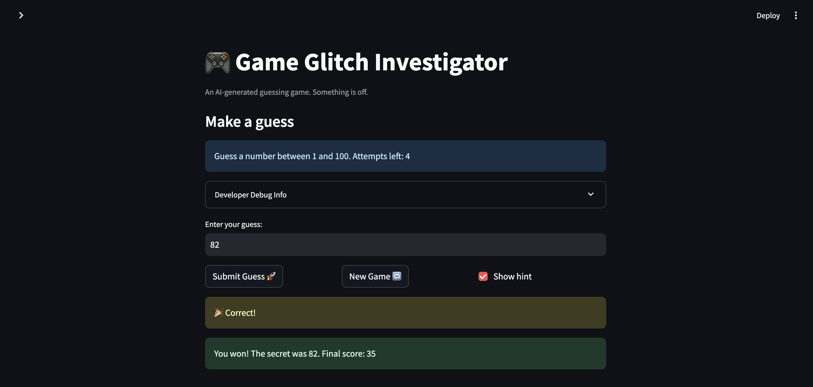
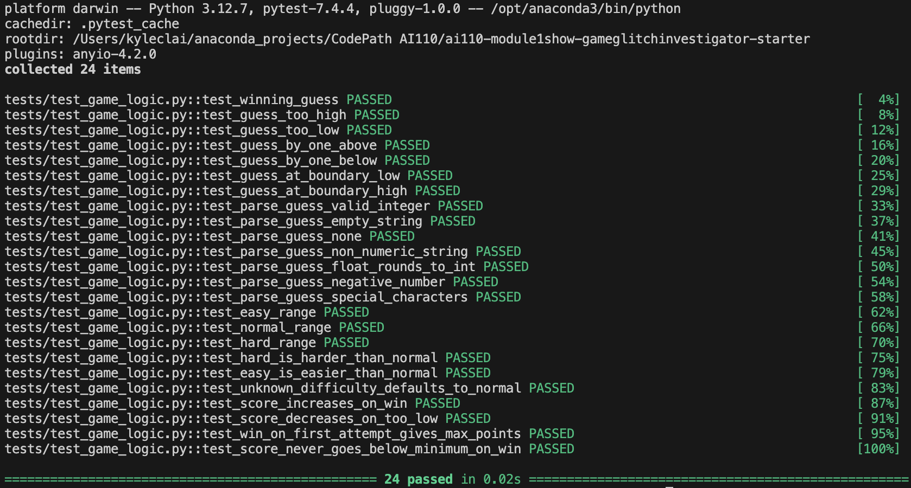

# 🎮 Game Glitch Investigator: The Impossible Guesser

## 🚨 The Situation

You asked an AI to build a simple "Number Guessing Game" using Streamlit.
It wrote the code, ran away, and now the game is unplayable. 

- You can't win.
- The hints lie to you.
- The secret number seems to have commitment issues.

## 🛠️ Setup

1. Install dependencies: `pip install -r requirements.txt`
2. Run the broken app: `python -m streamlit run app.py`

## 🕵️‍♂️ Your Mission

1. **Play the game.** Open the "Developer Debug Info" tab in the app to see the secret number. Try to win.
2. **Find the State Bug.** Why does the secret number change every time you click "Submit"? Ask ChatGPT: *"How do I keep a variable from resetting in Streamlit when I click a button?"*
3. **Fix the Logic.** The hints ("Higher/Lower") are wrong. Fix them.
4. **Refactor & Test.** - Move the logic into `logic_utils.py`.
   - Run `pytest` in your terminal.
   - Keep fixing until all tests pass!

## 📝 Document Your Experience

- [x] Describe the game's purpose.
- [x] Detail which bugs you found.
- [x] Explain what fixes you applied.

## 📸 Demo

- [x] Insert a screenshot of your fixed, winning game here

## 🚀 Stretch Features

- [x] [Challenge 1: Advanced Edge-Case Testing]

24 pytest cases covering edge cases across all four functions in `logic_utils.py` — including non-numeric strings, empty input, boundary values, float truncation, negative numbers, difficulty range comparisons, and score scaling. All 24 tests pass.

- [ ] [If you choose to complete Challenge 2, documenting experience using Feature Expansion via Agent Mode]

- [x] [Challenge 3: Professional Documentation and Linting]

Used the Generate Documentation smart action to add professional Google-style docstrings to all four functions in `logic_utils.py`, including `Args:`, `Returns:`, and `Examples:` sections. Return type annotations were also added to every function signature. Copilot's Fix feature was then used to review PEP 8 compliance — confirming consistent spacing, snake_case naming, and line lengths under 79 characters throughout.

- [ ] [If you choose to complete Challenge 4, insert a screenshot of your Enhanced Game UI here]

- [ ] [If you choose to complete Challenge 5, write about AI Model Comparison]
